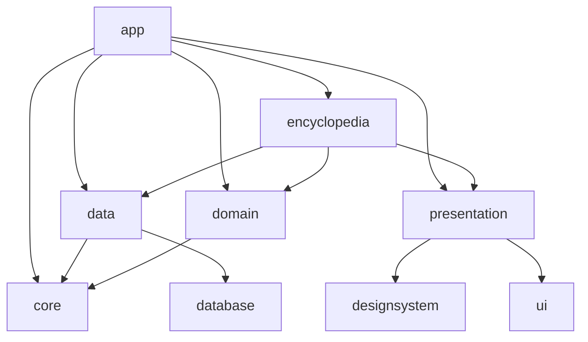

# PlantPedia Z

<p align="center">
  
</p>

<p align="center">
  A comprehensive guide to all plants and zombies in the "Plants vs. Zombies 2", powered by the Plants vs. Zombies 2 API.
</p>

<p align="center">
  
  
  
  
</p>

## Features

- Detailed information on all Plants vs. Zombies characters
- Search functionality
- User-created lists of favorite plants/zombies
- Offline viewing with cached data

## Screenshots

<p align="center">
  
  
  
</p>

## Table of Contents

- [Architecture](#architecture)
- [Tech Stack](#tech-stack)
- [Module Design](#module-design)
- [Project Structure](#project-structure)
- [Testing](#testing)
- [Contributing](#contributing)
- [License](#license)
- [Acknowledgments](#acknowledgments)
- [Contact](#contact)

## Architecture

PlantPedia Z initially built using Android Clean Architecture that follows the more familiar **Model-View-Intent** (MVI) pattern.

## Tech stack & Open-source libraries

-   Minimum SDK level 24
-   [Kotlin](https://kotlinlang.org/) based, [Coroutines](https://github.com/Kotlin/kotlinx.coroutines) + [Flow](https://kotlin.github.io/kotlinx.coroutines/kotlinx-coroutines-core/kotlinx.coroutines.flow/) for asynchronous.
-   Jetpack
    -   Lifecycle: Observe Android lifecycles and handle UI states upon the lifecycle changes.
    -   ViewModel: Manages UI-related data holder and lifecycle aware. Allows data to survive configuration changes such as screen rotations.
    -   Jetpack Compose: Modern toolkit for building native Android UI.
    -   [Hilt](https://dagger.dev/hilt/): for dependency injection.
-   Architecture
    -   MVI Architecture (Model - View - Intent)
    -   Repository pattern
-   [Retrofit2 & OkHttp3](https://github.com/square/retrofit): Construct the REST APIs and paging network data.
-   [Sandwich](https://github.com/skydoves/Sandwich): Construct a lightweight and modern response interface to handle network payload for Android.
-   [Moshi](https://github.com/square/moshi/): A modern JSON library for Kotlin and Java.
-   [Room](https://developer.android.com/training/data-storage/room): Constructs Database by providing an abstraction layer over SQLite to allow fluent database access.
-   [Material-Components](https://github.com/material-components/material-components-android): Material design components for building ripple animation, and CardView.
-   [Coil](https://github.com/coil-kt/coil): An image loading library for Android backed by Kotlin Coroutines.
-   [Timber](https://github.com/JakeWharton/timber): A logger with a small, extensible API.
-   [Turbine](https://github.com/cashapp/turbine): A small testing library for kotlinx.coroutines Flow.
-   [LeakCanary](https://square.github.io/leakcanary/): Memory leak detection library for Android.
-   [Firebase](https://firebase.google.com/)
    -   Authentication: For user authentication.
    -   Realtime Database: For storing user data and favorites.
    -   Cloud Messaging: For push notifications.
-   [WorkManager](https://developer.android.com/topic/libraries/architecture/workmanager): For managing Android background jobs.


-   [Detekt](https://detekt.github.io/detekt/): A static code analysis tool for the Kotlin programming language.
-   [Konsist](https://github.com/LemonAppDev/konsist): A pragmatic lightweight kotlin static analysis library.
-   [Plants vs. Zombies 2 API](https://pvz-2-api.vercel.app/): Provides data for plants and zombies (Note: Replace with actual API URL when available).

## Module Design

PlantPedia Z follows a modular architecture to improve build times, maintain a separation of concerns, and make the codebase more scalable and maintainable. Here's an overview of the app's modules:

| Module name     | Type                | Description                                                       |
|-----------------|---------------------|-------------------------------------------------------------------|
| `app`           | Android Application | Main application module, contains MainActivity and app-level dependencies |
| `core`          | Android Library     | Core business models, common utilities, and base classes          |
| `build-logic`   | Kotlin Library      | Custom Gradle plugins and build configuration                     |
| `convention`    | Kotlin Library      | Shared build logic and dependencies                               |
| `data`          | Android Library     | Data sources, repositories, and data models                       |
| `database`      | Android Library     | Local database implementation using Room                          |
| `domain`        | Kotlin Library      | Domain models, and business logic                      |
| `presentation`  | Android Library     | Shared presentation logic and utilities                           |
| `designsystem`  | Android Library     | UI components, themes, and design system implementation           |
| `ui`            | Android Library     | Shared UI utilities and extensions                                |
| `encyclopedia`  | Android Library     | Feature module for the main encyclopedia functionality            |

### Module Dependencies



This modular structure allows for:
- Parallel development by different teams
- Faster build times, especially for large projects
- Better encapsulation of features
- Easier maintenance and testing
- Potential for dynamic feature delivery in the future

## Project Structure

```
plantpediaZ/
├── app/
├── core/
├── build-logic/
├── convention/
├── data/
│   ├── src/main/java/dev/gaddal/core/data/
│   │   ├── auth/
│   │   ├── di/
│   │   ├── networking/
│   │   └── pvz/
├── database/
│   ├── src/main/java/dev/gaddal/core/database/
│   │   ├── dao/
│   │   ├── di/
│   │   ├── entity/
│   │   └── mappers/
├── domain/
│   ├── src/main/java/dev/gaddal/core/domain/
│   │   ├── pvz/
│   │   ├── util/
├── presentation/
├── designsystem/
│   ├── src/main/java/dev/gaddal/core/presentation/designsystem
│   │   ├── components/
├── ui/
│   ├── src/main/java/dev/gaddal/core/presentation/ui
├── encyclopedia/
│   ├── data/
│   ├── domain/
│   ├── network/
│   ├── presentation/
│   │   ├── areas/
│   │   ├── plants/
│   │   └── zombies/
└── build.gradle
```
## Testing

This project uses:
- JUnit for unit tests
- Espresso for UI tests
- Mockito for mocking in tests
- Robolectric for unit testing Android components
- Turbine for testing Coroutines flows

### Testing Strategy

- Unit tests for repositories, and ViewModels
- UI tests for critical user flows
- Integration tests for API and database interactions

## API Usage

Base URL: `https://pvz-2-api.vercel.app/api`

Main endpoints:

-   `/plants`: Get all plants
-   `/plants/{name}`: Get specific plant
-   `/zombies`: Get all zombies
-   `/zombies/{name}`: Get specific zombie
-   `/areas`: Get all areas
-   `/areas/{name}`: Get specific area

Example: `https://pvz-2-api.vercel.app/api/plants/aloe`

Note:

-   This is a free, open API with no authentication required.

## Impact of Modular Architecture

1.  **Development Workflow**:
    -   Enables parallel development of features by different teams.
    -   Facilitates easier code reviews and feature isolation.
2.  **Testing Strategy**:
    -   Allows for more focused and efficient unit testing of individual modules.
    -   Enables easier integration testing between modules.
3.  **CI/CD Pipeline**:
    -   Supports faster build times by allowing parallel building of modules.
    -   Enables module-specific CI/CD workflows for more targeted deployments.

## Contributing

Contributions are welcome! Please feel free to submit a Pull Request.

1. Fork the Project
2. Create your Feature Branch (`git checkout -b feature/AmazingFeature`)
3. Commit your Changes (`git commit -m 'Add some AmazingFeature'`)
4. Push to the Branch (`git push origin feature/AmazingFeature`)
5. Open a Pull Request

## License

This project is licensed under the MIT License - see the [LICENSE](LICENSE) file for details.

## Acknowledgments

- Plants vs. Zombies 2 API for providing the data
- The Android development community for their invaluable resources and libraries

## Contact

Hussain Gaddal - hussain.yg2010@gmail.com

Project Link: [https://github.com/IronManYG/PlantPediaZ](https://github.com/IronManYG/PlantPediaZ)
